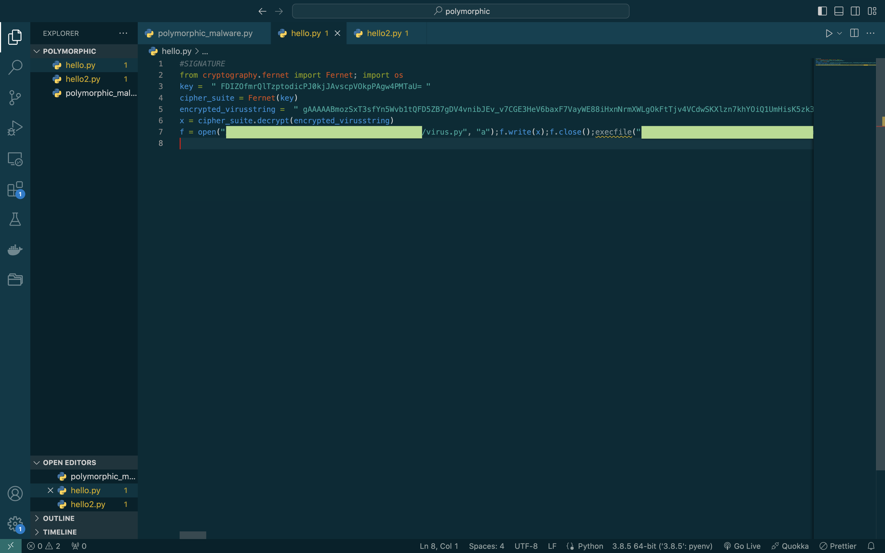
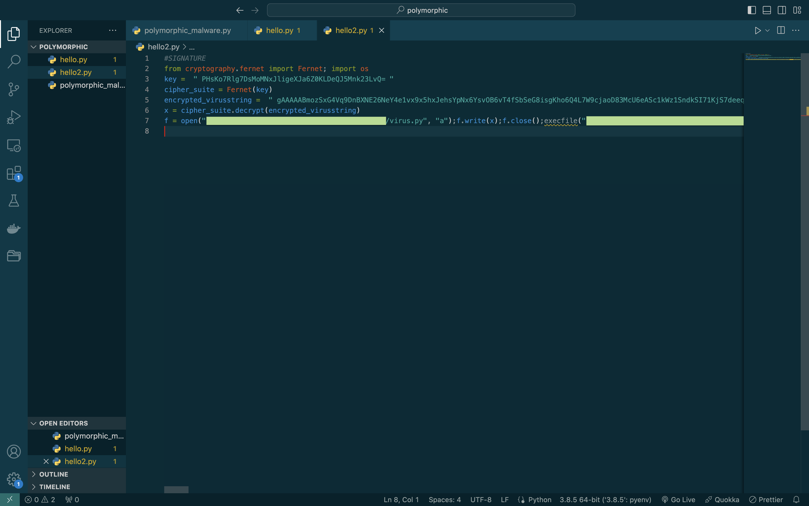
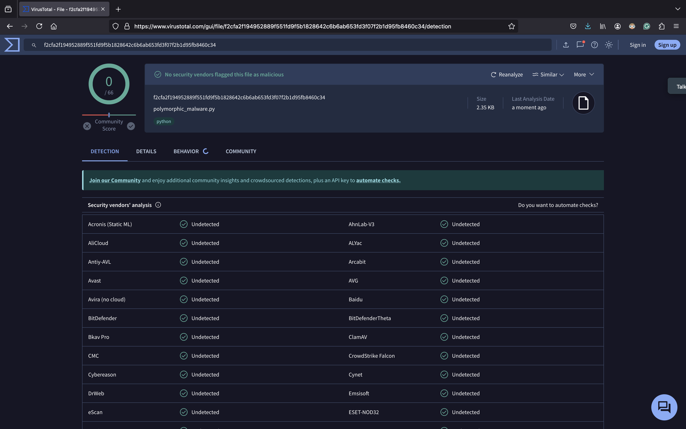

# Polymorphic Malware

This project demonstrates a polymorphic malware script written in Python. It shows how malware can use polymorphism to evade detection by traditional static antivirus software.

## Description

The malware searches for Python files (`.py`) within a specified directory, checks for a signature to avoid reinfection and injects an encrypted copy into the target files. Each infection generates a unique encryption key, making each infected file different from others. The primary aim is to demonstrate how polymorphic malware can avoid detection by traditional static analysis techniques.

### Features

- **Signature-Based Prevention:** The script uses a specific signature to prevent reinfection of already infected files.
- **File Infection:** Infects `.py` files by inserting an encrypted payload.
- **Polymorphism:** Generates a unique encryption key for each infected file, ensuring that each instance is unique.
- **Payload Execution:** Decrypts and executes the payload in the target files.

## How It Works

1. **Search for Target Files:**
   - The script recursively searches through directories to find Python files that do not contain the infection signature.
   
2. **Infect Files:**
   - For each target file, the script:
     - Reads the malware code into a string.
     - Generates a unique encryption key using the `Fernet` module from the `cryptography` package.
     - Encrypts the malware code and writes it to the target file with decryption logic.
     
3. **Execute Payload:**
   - The infected file, when executed, decrypts the embedded malware code and runs it, continuing the infection cycle.

## Installation

1. **Clone the repository:**
```
git clone https://github.com/Piyush-Bhor/polymorphic-malware.git

cd polymorphic-malware
```
2. **Install Dependencies:**

Make sure you have Python installed along with the cryptography library:
```
pip install cryptography
```

3. **Run the Malware:**

**Note:** Run this script with Python 2, not Python 3.

Execute the script on a specific directory:
```
python2 polymorphic_malware.py
```

Here’s a screenshot showing how two separate infected files look:




## VirusTotal Analysis

I uploaded the script on VirusTotal, and none of the 66 security vendors detected it.



## Important Note

This project is intended for educational and research purposes only. Running or distributing malware is illegal and unethical. Please don't be stupid.

## License
This project is licensed under the MIT License. You can read it [here](https://github.com/Piyush-Bhor/polymorphic-malware/blob/main/LICENSE) .
